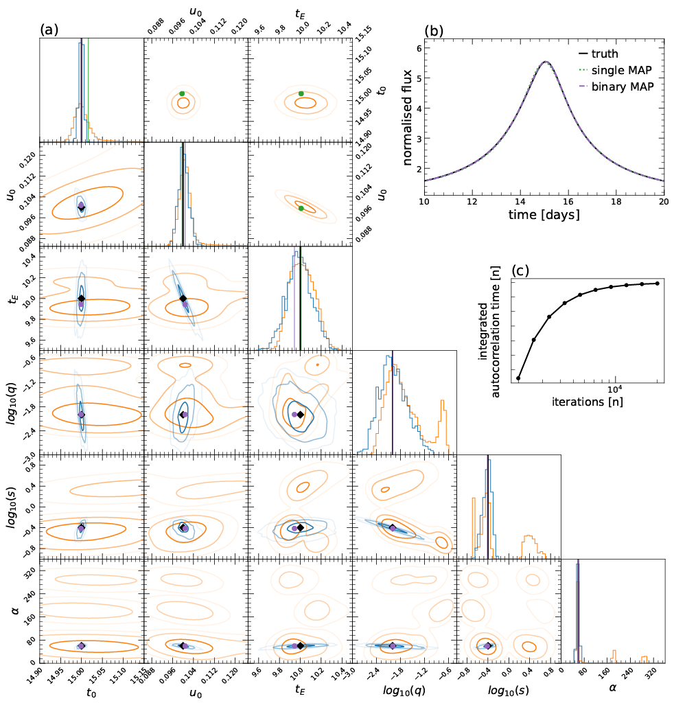

# microlensing-model-inference
The estimation of parameters for gravitational microlensing events typically proceeds by fitting proposed lens models to observed data. A problem arises in this approach when alternate parameter values or models produce similar representations, since some comparison must be made between them. This is a challenging problem which has been frequently tackled via Bayesian model selection. Previously this was impractical since the gravitational microlensing joint model posterior is multi-modal and the computational expense required to sample an accurate discretisation prohibitive. Recently [Zhang et al. (2021)](https://iopscience.iop.org/article/10.3847/1538-3881/abf42e) showed how a neural network can be used to quickly approximate the model dependent posterior distribution of gravitational microlensing data. We show how, in combination with technqiues from Bayesian statistics, this can be used to estimate marginal model probabilities from gravitational microlensing data by speeding up the previously prohibitively slow sampling burn-in period. 

This library implements an adaptive reversible-jump algorithm that efficiently refines a suite of surrogate posteriors to the true joint model posterior.

This is a code repository for the the paper [Microlensing model inference with normalising flows and reversible jump MCMC](https://doi.org/10.1016/j.ascom.2022.100657).

## Exemplar Posterior
To estimate the marginal model probabilities, the adaptive reversible-jump algorithm constructs a discrete analogue of the true posterior that is joint over all candidate models. For example:



(a) ARJMH estimated joint-model posterior of a clear binary lensing event compared to the surrogate posterior of each candidate lens model. Off-diagonals show the 1, 2 and 3−σ contours of each surrogate posterior in orange and the joint posterior in blue. The lower the density of the contour the lower its opacity. Note that there are no contours shown in the single lensing region of the joint model posterior as it essentially contains no density (the lightcurve is beleived to be generated by binary lensing). True binary parameter values are shown in grey, and single and binary map samples respectively shown in green and purple. The diagonal shows the marginal distributions of each parameter. The parameter fs is not shown for clarity. (b) True light curve and resulting map estimates. (c) The IAC of the model index parameter.

The data from this figure was constructed with **example_inference.py**.

## Dependencies
This library uses [MulensModel](https://rpoleski.github.io/MulensModel/install.html) to model gravitational microlensing systems.

## Usage
To construct synthetic gravitational microlensing data and initialise a single lens model:
```python
import distributions
import light_curve_simulation
import sampling

# Generate a discrete synthetic single lens event (with added noise).
parameters = [0.9, 15.0, 1.1, 32.0]
theta = sampling.State(truth=parameters)
n_observations = 720
signal_to_noise_ratio = 23

data = light_curve_simulation.synthetic_single_lens(theta, n_observations, signal_to_noise_ratio)

# Create a list of single lens parameter prior distributions.
fs_pi = distributions.LogUniform(0.1, 1)
t0_pi = distributions.Uniform(0, 72)
u0_pi = distributions.Uniform(0, 2)
tE_pi = distributions.LogUniform(1, 100)

single_priors = [fs_pi, t0_pi, u0_pi, tE_pi]

# Initialise the single lens model Gaussian proposal distribution (a guess* at the true covariance of this model's posterior).
single_covariance = [[0.1, 0.0, 0.0, 0.0],
                     [0.0, 1.0, 0.0, 0.0],
                     [0.0, 0.0, 0.1, 0.0],
                     [0.0, 0.0, 0.0, 1.0]]

# Initialise the single lens model centre (a guess* at the true parameters).
single_centre = sampling.State(truth=[0.9, 15.0, 1.1, 32.0])

# Initialise the single lens model.
model_index = 0
dims = 4
single_Model = sampling.Model(model_index, dims, single_centre, single_priors, single_covariance, \
                                  data, light_curve_simulation.single_log_likelihood)
```

To sample from a joint single/binary lens model posterior:

```python
# Create pool of models.
Models = [single_Model, binary_Model]

# Sample from the joint posterior.
joint_model_chain, total_acc_history, inter_model_acc_history = \
                               sampling.ARJMH(Models, iterations, warm_up_iterations)
```
*For a use case which accurately approximates the centers and covariances with surrogate posteriors derived from neural networks, see **example_inference.py**.

## Authors and Acknowledgements
Reversible-jump algorithm and supporting code created by Dominic Keehan.

Neural networks and surrogate posteriors created by [Jack Yarndley](https://github.com/jackyarndley).

Bachelor of Engineering Science Honours project at the University of Auckland, supervised by [Nicholas Rattenbury](https://unidirectory.auckland.ac.nz/profile/n-rattenbury).
